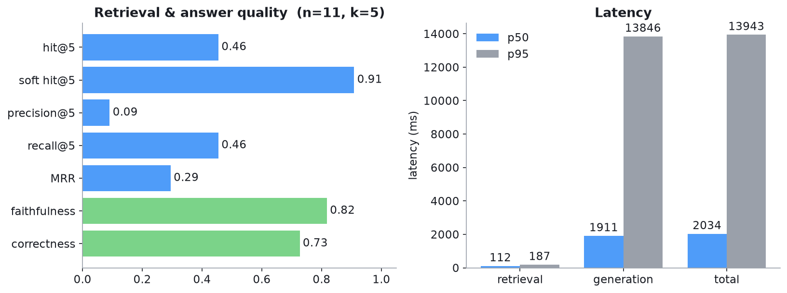

# secrag

[](https://github.com/AnoopIbrampur/secrag/actions/workflows/tests.yml)


A question-answering system over real SEC 10-K filings that cites its sources and
ships with an evaluation harness I can defend line by line.

Most RAG demos stop at "look, it answers questions." The part that matters in
production is whether retrieval finds the right passage and whether the answer is
grounded in it, so this repo measures both. Ask a
question, get an answer with inline `[n]` citations that link back to the exact
filing and section, and run the eval harness to see retrieval precision, answer
faithfulness, and latency on a labeled question set.



## Results

Evaluated on labeled questions, each tagged with the filing chunk that contains
the answer, so retrieval can be scored against ground truth. Numbers below are a
free-tier-limited sample (see the note under the table) but every one is
reproducible from `eval/run_eval.py`.

| Metric | Value | Reading |
|---|---|---|
| `hit@5` (exact gold chunk) | 0.45 | the exact labeled chunk lands in the top 5 |
| `soft hit@5` (gold section) | **0.91** | the right filing + section lands in the top 5 |
| `faithfulness` | **0.82** | answers stay grounded in the retrieved text |
| `correctness` | **0.73** | answer matches the gold answer |
| retrieval latency (p50) | **112 ms** | local embeddings, no API round-trip |
| total latency (p50 / p95) | 2.0 s / 13.9 s | generation dominates; p95 is one slow call |

The gap between `hit@5` (0.45) and `soft hit@5` (0.91) is the interesting part.
The retriever almost always finds the right section of the right filing; it just
often returns a neighboring chunk rather than the one exact chunk a question was
written from, because adjacent chunks in a section overlap and look nearly
identical to the embedder. So `soft hit@5` is the fairer read of retrieval, and
answer correctness (0.73) tracks it: when the right section makes the top 5, the
model usually gets the answer right. Faithfulness at 0.82 means most answers stay
grounded in the retrieved text, with the occasional claim the judge couldn't tie
back to a source — the per-question `unsupported_claims` in `results.json` make
those easy to spot-check. The clearest lever from here is finer chunk granularity
(or hybrid lexical + dense retrieval) rather than more prompt tuning.

> **On sample size.** The eval ran on n=11 — 6 of the 17 labeled questions were
> skipped when a model hit Google's Gemini free-tier cap of 20 requests/day/model
> (a full pass needs three calls per question, spread across three models). The
> harness itself runs at any N: point it at a larger labeled set or wire in more
> models, and it scales. The methodology is the deliverable, and the numbers
> refresh with one command.

## How it works

```
SEC EDGAR API ─▶ ingest ─▶ section-aware ─▶ local embeddings ─▶ Chroma
 (public, no key)  (iXBRL    chunking         (bge-small,         (vector
                    strip)   (10-K Items)      no API key)         index)
                                                                     │
                                               query ────────────────┤
                                                 │                    ▼
                                           local embed ─▶ top-k chunks ─▶ Gemini ─▶ answer
                                                                           (grounded   + [n]
                                                                            + cited)   citations
```

A few decisions worth calling out:

- **Embeddings run locally** (`sentence-transformers`, `bge-small-en-v1.5`), so
  retrieval costs nothing per query and needs no key. Generation is the only
  hosted piece, behind `secrag/llm.py`, so swapping the provider is a one-file
  change.
- **iXBRL-aware extraction.** Modern 10-Ks interleave readable prose with
  machine-readable XBRL tags. A naive HTML strip dumps thousands of lines of tag
  soup into the text; the extractor drops the hidden XBRL context but keeps the
  inline tags that wrap reported figures, so dollar amounts survive. This is
  covered by a unit test.
- **Section-aware chunking.** Chunks carry the 10-K Item they came from (Item 1A
  Risk Factors, Item 7 MD&A, ...), which is what makes citations specific and
  retrieval scoreable.

## Stack

| Layer | Choice |
|---|---|
| Corpus | SEC 10-K via the public EDGAR API |
| Parsing | BeautifulSoup, inline-XBRL aware |
| Embeddings | `sentence-transformers` (bge-small, local) |
| Vector store | Chroma (persistent, cosine) |
| Generation | Google Gemini (`gemini-2.5-flash-lite`, free tier) |
| API | FastAPI + Uvicorn |
| Frontend | single-page HTML/JS |
| Eval judge | Gemini (LLM-as-judge) |
| Packaging | Docker / docker-compose |

## Quickstart

```bash
python3 -m venv .venv && source .venv/bin/activate
pip install -r requirements.txt
cp .env.example .env          # add a free GEMINI_API_KEY (aistudio.google.com/apikey)
export PYTHONPATH=src

python -m secrag.ingest AAPL MSFT NVDA AMZN JPM XOM   # download 10-Ks (no key)
python -m secrag.index build                          # chunk + embed + index (no key)
python -m secrag.index query "What are NVIDIA's competitive risks?"   # retrieval only, no key

uvicorn secrag.api:app --reload    # http://localhost:8000
# or
docker compose up --build
```

Only `GEMINI_API_KEY` is required, and only for answer generation and the eval
judge. Ingestion, chunking, embeddings, and retrieval all run with no key.

## Evaluation

```bash
cd eval
# 1. Draft candidate Q&A from indexed chunks (then review them):
PYTHONPATH=../src python build_questions.py --n 30
#    review questions.candidates.jsonl, fix/drop rows, set verified=true,
#    rename to questions.jsonl
# 2. Score retrieval, faithfulness, correctness, and latency:
PYTHONPATH=../src python run_eval.py --questions questions.jsonl --k 5
# 3. Redraw the figure:
PYTHONPATH=../src python plot_results.py
```

**Metrics.** Retrieval is scored against the gold chunk each question was written
from: `hit@k`, `precision@k`, `recall@k`, `MRR`, plus `soft hit@k` (gold chunk
*or* same filing+section, which tolerates the chunk-overlap effect above). Answer
quality uses an LLM judge: `faithfulness` (is every claim supported by the
retrieved context?) and `correctness` (does the answer match the gold answer?).
Latency is reported as p50/p95, split into retrieval and generation.

The labeled questions are bootstrapped: Gemini drafts a question and gold answer
from a sampled chunk, then they get reviewed and the weak ones dropped. That is
why each question already knows its gold chunk for retrieval scoring.

## Honest limitations

- **Small, skewed sample.** The committed eval set is modest and over-weights
  JPMorgan, because random chunk sampling follows corpus size and JPM's 10-K is
  by far the largest. A production run wants a balanced, larger set.
- **LLM-as-judge is a proxy.** Faithfulness and correctness come from a model,
  not a human. `results.json` keeps the per-question `unsupported_claims` so the
  judgments can be spot-checked.
- **Demo corpus.** Six filings here; scaling to thousands is more tickers through
  `ingest` (respecting EDGAR's ~10 req/s limit).

## License

MIT, see [LICENSE](LICENSE).
